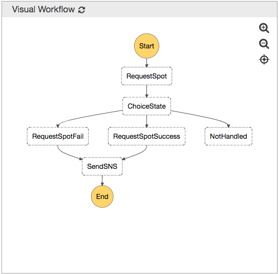

Demonstrate how to use AWS Step Functions to create EC2 instances with conditions.

At starting state, make a spot request, if fail then create EC2 on-demand instances instead.



# Define a lambda function

To implement  RequestHandler class with input pojo and output pojo will be a  better choice.

Never just leave a String class to be within. That's not readable.


```
package solid.humank.statehandler;

import com.amazonaws.services.lambda.runtime.Context;
import com.amazonaws.services.lambda.runtime.RequestHandler;
import solid.humank.model.EC2Request;
import solid.humank.model.EC2RequestResult;


public class RequestSpotHandler implements RequestHandler<EC2Request, EC2RequestResult> {

    public static final String REQUEST_SUCCESS = "SUCCESS";

    @Override
    public EC2RequestResult handleRequest(EC2Request input, Context context) {

        return new EC2RequestResult(REQUEST_SUCCESS);
    }
}

```

# Deploy a lambda function by aws cli

* Create RequestSpotHandler

```
 aws lambda create-function
--function-name RequestSpotHandler
--runtime java8
--role <YourIAMRoleWhichHasLambdaExecutionPolicies>
--handler <value>
[--code <value>]
[--description <value>]
[--timeout <value>]
[--memory-size <value>]
[--publish | --no-publish]
[--vpc-config <value>]
[--dead-letter-config <value>]
[--environment <value>]
[--kms-key-arn <value>]
[--tracing-config <value>]
[--tags <value>]
[--zip-file <value>]
[--cli-input-json <value>]
[--generate-cli-skeleton <value>]

```

